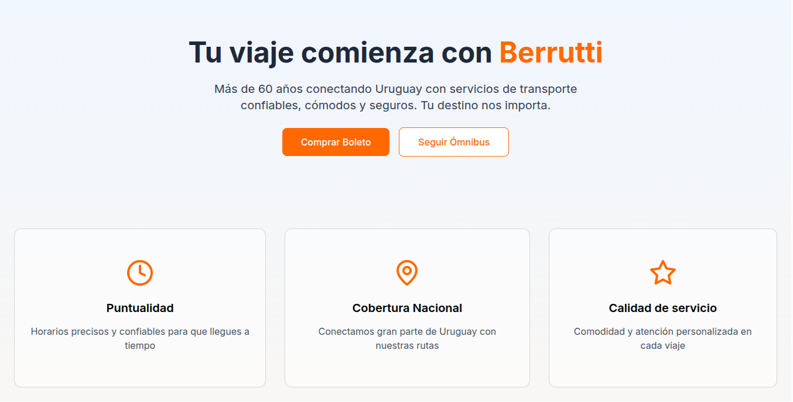
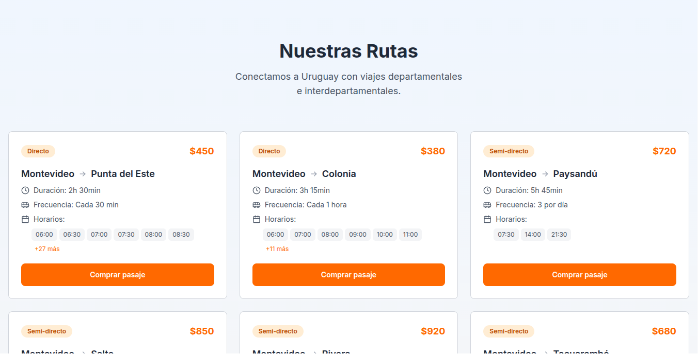
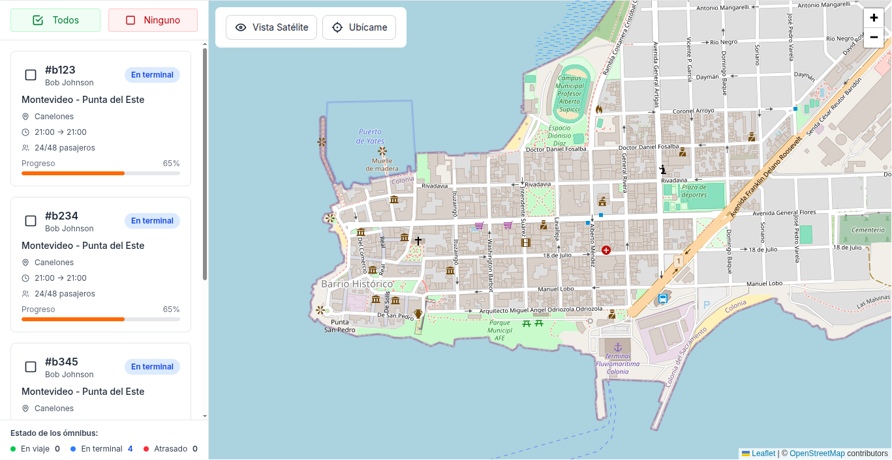

# Proyecto Final – Frontend

Frontend de la web para **Berrutti Turismo**, desarrollado como proyecto final de 3ºMA (IAE).
La web ofrece una experiencia moderna y rápida para pasajeros y choferes, con diseño responsivo, temas claro y oscuro, compra de boletos online y seguimiento de ómnibus en tiempo real.

**Stack principal:** [Astro](https://astro.build/) · [Preact](https://preactjs.com/) · [TailwindCSS](https://tailwindcss.com/) · [TypeScript](https://www.typescriptlang.org/)

**Equipo:**

* Matías Iturralde
* Luis Quevedo
* Matías Giménez
* Federico Artencio
* Emanuel Cordeiro

---

## 🚀 Instalación y comandos

Requisitos: [Node.js (>= 20.6.0)](https://nodejs.org/), se recomienda [pnpm (>= 8)](https://pnpm.io/) pero también funciona con npm o bun.

```sh
# Instalar dependencias
pnpm install

# Desarrollo (http://localhost:4321 o el puerto disponible)
pnpm dev

# Compilación para producción
pnpm build

# Previsualizar la build
pnpm preview
```

Variables de entorno:

```sh
# Solo para los mocks de datos en desarrollo
PUBLIC_ORIGIN="http://localhost:4321"
```

---

## 🌐 Navegación

El sitio ya está desplegado en [Cloudflare Pages](https://proyecto-final-frontend.pages.dev).

* `/` – Página principal, acceso directo a **comprar boleto** o **seguir ómnibus**.
* `/services/` – Los servicios para los viajes, encomiendas, giros, trámites, etc.
* `/routes/` – Lista de rutas fijas, con detalles de cada viaje y compra de pasajes.
* `/track/` – Seguimiento en tiempo real de los ómnibus en el mapa (Leaflet y OSM).
* `/contact/` – Información de contacto y teléfonos de emergencia.
* `/about/` – Próximamente.
* `/custom-trips/` – Viajes personalizados (en progreso).
* `/qr/` – Comprobante de compra con código QR.





---

## ✨ Funcionalidades principales

**Compra de boletos online**

  * Selección de cantidad de pasajeros y asientos.
  * Formulario de datos del pasajero principal y acompañantes.
  * Integración con **MercadoPago** (en desarrollo).
  * Resumen claro de la compra y estado de pago.
  * Generación de comprobante QR descargable o compartible.

**Seguimiento de ómnibus**

  * Visualización de rutas en mapa interactivo con [Leaflet](https://leafletjs.com/).
  * Información del bus: modelo, año, capacidad, chofer, horarios, duración y servicios (A/C, baño, TV, etc.).
  * Ubicación en tiempo real del vehículo.
  * Progreso de la ruta (planificado para implementar).

**QR y validación**

  * Cada boleto genera un **código QR único**.
  * Lo validas con el lector QR del chofer.
  * El estado cambia según uso: pendiente, usado, vencido (si se vence se te devuelve el dinero).

**Diseño moderno y accesible**

  * Tema oscuro en la mayoría de páginas.
  * Totalmente responsivo (desktop, tablet, móvil).
  * Navegación intuitiva con header en pantallas grandes y sidebar en celulares y tablets.

---

## 📚 Documentación y manuales

* 📖 [Documento de entrega](https://docs.google.com/document/d/1_Y1R1E1OG2PVn79fYFMBiSY__FAvEOf6Qnb7Yd-YyUY/edit?usp=sharing)
* 🛠️ [Documentación técnica](https://documentacion-tecnica.pages.dev)
* 📑 [Manual de usuario](https://docs.google.com/document/d/1HYqyLmWW_HVXNQsMj20KHgw6Cl3H9heT08ONiSGh4oY/edit?usp=sharing)

Repositorios:

* [Frontend](https://github.com/Ubiufboeuf/proyecto-final-frontend)
* [Servidor (HTTP)](https://github.com/Ubiufboeuf/proyecto-final-backend)
* [Servidor (WS)](https://github.com/Ubiufboeuf/proyecto-final-backend-ws)

---

## 📌 Estado actual

✅ Terminado
* Inicio
* Servicios
* Rutas
* Seguimiento
* Contacto (visualmente)
* Página de login y registro (visualmente)
* Acerca de la empresa (Berrutti)
* Viajes personalizados (visualmente)

<!-- ➖ En proceso -->
<!-- * Contacto (el formulario de contacto) -->

⚠️ Pendiente
* Página del chofer con seguimiento de su ómnibus.
* Integración completa con MercadoPago.
* Página de comprobante QR.


Para terminar el funcionamiento de las págians terminadas visualmente nos faltan partes del servidor (http) aún pendientes.

---

## 📄 Licencia

Este proyecto es académico y no cuenta con licencia formal.
